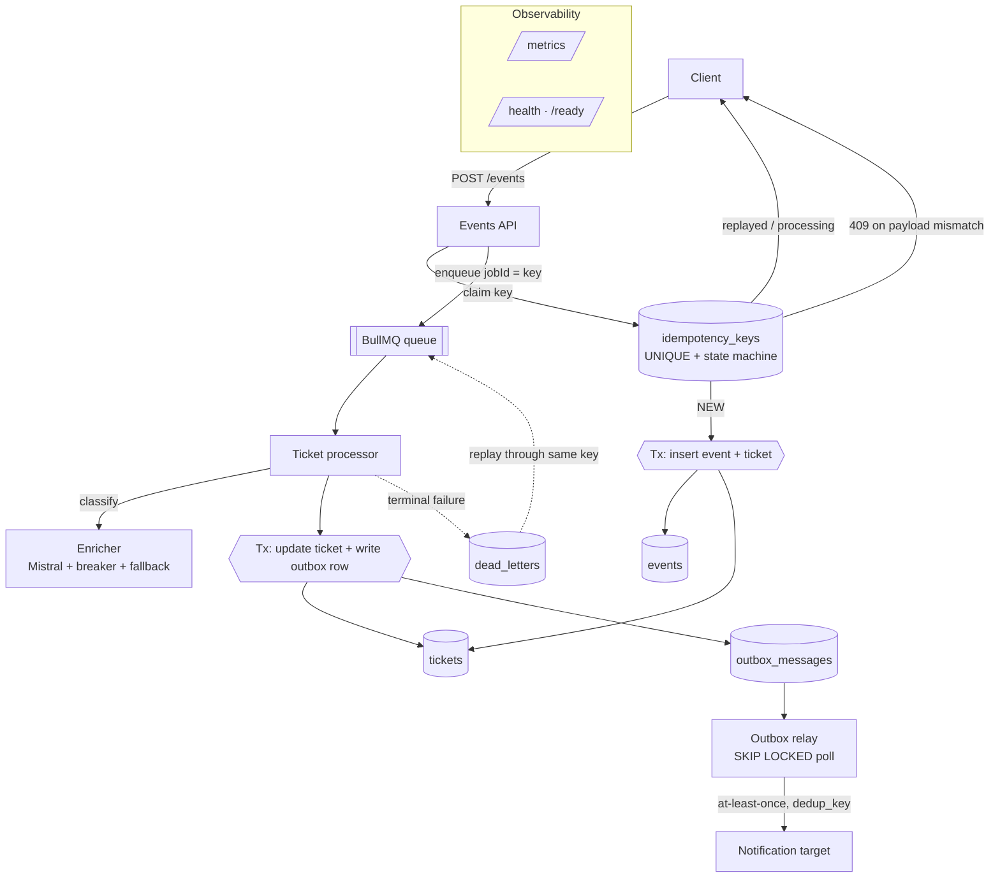

# Triage Engine

[](https://github.com/younesKAOUANI/triage-engine/actions/workflows/ci.yml)

An event-processing service that ingests support tickets, classifies them with an
LLM, and notifies a downstream system. NestJS, Postgres, Redis/BullMQ, Mistral.

Running at **[triage-engine.youneskaouani.dev](https://triage-engine.youneskaouani.dev)**
— `/ready`, `/metrics` and `/dlq` are open, and `POST /events` accepts work
(rate limited).

The classification itself is a few hundred lines. Most of this repo is the part
that keeps working when things go wrong: duplicate deliveries, worker crashes
mid-job, a notification target returning 500s, and a model that is sometimes
slow, sometimes down, and sometimes returns confident nonsense.

```bash
make up     # app + postgres + redis, migrations run on boot
make seed   # post a few sample tickets
make test   # integration suite against real postgres + redis
```

---

## The problem

Events arrive from systems you don't control. Those systems retry on timeout and
deliver at-least-once, so the same ticket shows up twice, or twelve times, or
twice simultaneously. Meanwhile your own worker can die halfway through a job
that has already written half its state.

The requirement that falls out of this is narrow and unforgiving: **one ticket
and one notification per event, no matter how many times it is delivered or how
badly the middle of the pipeline fails.**

Getting that right is mostly about refusing to lose things quietly. Every
mechanism below is a variation on the same idea.

| Where work can disappear | What stops it |
| --- | --- |
| The same event delivered twice, or twice at once | Idempotency ledger: a `UNIQUE` key plus a status machine, with the race settled by Postgres rather than application locks ([ADR-0001](docs/adr/0001-idempotency-strategy.md)) |
| A ticket updated, but its notification never sent | Transactional outbox: the notification row is written in the same transaction as the state change ([ADR-0004](docs/adr/0004-outbox-pattern.md)) |
| A notification lost between commit and HTTP call | Relay polls with `FOR UPDATE SKIP LOCKED` and delivers at-least-once against a `dedup_key` ([ADR-0008](docs/adr/0008-outbox-relay-polling.md)) |
| A job that runs out of retries | Dead letters land in a Postgres table with full context and a replay endpoint ([ADR-0007](docs/adr/0007-durable-dlq-table.md)) |
| A ticket stuck because the model is down | Rule-based fallback classifies it now; an AI upgrade is queued for later ([ADR-0005](docs/adr/0005-ai-failure-handling.md), [ADR-0006](docs/adr/0006-fallback-classifier.md)) |
| Malformed model output written to the database | Every response is schema-validated; a bad one is treated as a failed call |
| A ticket left degraded because its upgrade job vanished | A sweep re-drives stale degraded tickets, treating Postgres as the source of truth ([ADR-0009](docs/adr/0009-degraded-reconciliation-sweep.md)) |

The last row is the one I'd point at first. Everything above it is a known
pattern. That one exists because after building the rest I went looking for
what could still go silently wrong, and found a gap: if the delayed upgrade job
were lost, a ticket would sit degraded forever and nothing would notice.

---

## How it fits together



One process runs the API, the worker, the relay and the sweep. They share no
mutable state; the only coordination is Postgres and Redis, so splitting them
into separate deployments is a wiring change rather than a redesign.

A correlation id is minted at ingestion and threaded through the HTTP request,
the queue job, the worker, the model call and the outbound webhook, so one id
follows a ticket end to end.

For the full walkthrough — data model, every flow step by step with line
references, and the failure behaviour of each component — see
[docs/ARCHITECTURE.md](docs/ARCHITECTURE.md).

---

## Design decisions worth explaining

**Concurrency is settled in the database, not in the application.** Claiming an
idempotency key is `INSERT … ON CONFLICT DO NOTHING`; exactly one of N
simultaneous callers gets a row back. Recovering a key abandoned by a crashed
worker is a conditional `UPDATE` whose `WHERE` clause Postgres re-evaluates under
the row lock, so two recoverers can't both win. There are no application locks to
leak or mis-expire, and it behaves correctly across any number of replicas
without extra work. → [ADR-0001](docs/adr/0001-idempotency-strategy.md)

**TypeORM, for a specific reason.** This system is mostly hand-written
transactional SQL, and TypeORM lets raw SQL and entity writes share one
`EntityManager` and one transaction. For an ordinary CRUD product I'd reach for
Prisma and enjoy the generated types more. → [ADR-0002](docs/adr/0002-orm-choice.md)

**Side effects go through an outbox.** `OutboxService.emit` only accepts an
existing transaction's `EntityManager`, and there is deliberately no method to
emit outside one, so the pattern can't be bypassed by accident. →
[ADR-0004](docs/adr/0004-outbox-pattern.md)

**Dead letters live in Postgres, not Redis.** They're queryable, they survive a
Redis flush, and replay re-enters through the *original* idempotency key, so a
replayed job can't duplicate a ticket or a notification. Deciding when a job is
truly finished turned out to be the subtle part: BullMQ retires jobs on several
paths that never increment the attempt counter, and reading only that counter
drops them silently. → [ADR-0007](docs/adr/0007-durable-dlq-table.md)

**The model is never on the critical path for availability, only for quality.**
Every call is timed out, retried with jitter, wrapped in a circuit breaker and
schema-validated. Any failure produces a rule-based classification with low
confidence instead of an error, and queues an upgrade attempt for when the model
recovers. → [ADR-0005](docs/adr/0005-ai-failure-handling.md), [ADR-0003](docs/adr/0003-circuit-breaker.md)

All nine decisions are written up in [docs/adr/](docs/adr/).

---

## API

| Method & path | Purpose |
| --- | --- |
| `POST /events` | Ingest an event. `202` with `accepted`, `processing` or `replayed`. `409` if the key was reused with a different payload, `400` if the key can't be used as a job id. |
| `GET /tickets/:id` | Fetch a ticket with its classification and status. |
| `GET /dlq` | List dead letters (filter by `?status=`, paginate). |
| `GET /dlq/:id` | One dead letter, including the stored payload and stack trace. |
| `POST /dlq/:id/replay` | Replay through the original idempotency key. `202`. |
| `GET /metrics` | Prometheus exposition. |
| `GET /health` · `GET /ready` | Liveness (process only) · readiness (Postgres + Redis). |
| `POST /_sink/webhook` · `GET /_sink/deliveries` | Bundled idempotent notification target so the stack runs offline. |

```bash
curl localhost:3000/health

curl -XPOST localhost:3000/events -H 'content-type: application/json' \
  -d '{"idempotencyKey":"demo-1","subject":"Double charged","body":"Refund please","requesterEmail":"a@b.com"}'

curl localhost:3000/tickets/<id-from-response>
curl localhost:3000/_sink/deliveries
curl localhost:3000/metrics
```

Metrics cover ingestion outcomes, pipeline throughput and failure disposition,
classification latency and result by source, circuit-breaker state, and the depth
of every buffer where work can pile up unseen: queue, DLQ and outbox.

---

## Running it

Docker and Docker Compose. For running the app on the host instead, Node 22+.

```bash
make up       # build and start everything; creates .env from .env.example
make logs     # tail the app
make migrate  # run migrations explicitly
make down     # stop and remove volumes
```

If ports 5432 or 6379 are busy on your machine, remap only the published ports —
they're decoupled from the in-container ones, so the app is unaffected:

```bash
POSTGRES_PORT=5440 REDIS_PORT=6390 make up
```

Configuration lives in `.env`; [.env.example](.env.example) documents every value
and is a working default. The app boots without `MISTRAL_API_KEY` and degrades to
the rule-based classifier rather than failing. Schema changes go through explicit
migrations, never `synchronize`.

### Deploying it

A host shared with two other projects runs the stack behind a single edge Caddy,
which handles TLS for all of them automatically and lives in the [portfolio
repository](https://github.com/younesKAOUANI/portfolio/tree/main/deploy/edge).
Postgres and Redis are containers on an internal network with no route off the
box, and this stack publishes no port at all. Pushing to `main` runs the tests,
builds an image, pushes it to GHCR and deploys it by commit sha, then polls
`/ready` and fails the run if the new revision never serves traffic.

```bash
make prod-up     # start the stack (needs .env from .env.production.example)
make prod-logs
make backup      # pg_dump to ./backups
```

Full runbook, secrets, rollback and the metrics worth alerting on:
[docs/DEPLOYMENT.md](docs/DEPLOYMENT.md).

---

## Tests

```bash
make test        # integration suite (Testcontainers: real Postgres + Redis)
npm run test:unit
```

The suite runs against real infrastructure, and that choice came from being
burned. During development the idempotency recovery and DLQ replay both passed
every check I'd written, and twelve concurrent identical submissions correctly
produced exactly one ticket. But the *responses* were wrong: most reported
`accepted` instead of a duplicate status. The cause was a TypeORM detail — its
raw `query()` returns a flat array for `INSERT … RETURNING` but a
`[rows, affectedCount]` tuple for `UPDATE … RETURNING`, so a `.length > 0` check
was always true and handed every concurrent caller a "you won the race" result.

The data invariant held anyway, because the row lock and the outbox `dedup_key`
independently absorbed the mistake. That's defence in depth doing its job, and
it's also why the bug was invisible: nothing was corrupted, only the semantics
were wrong. A suite built on mocks would never have found it.

So: Postgres and Redis are real, and the concurrency, `SKIP LOCKED` and
`RETURNING` behaviour under test is exactly what runs in production. Only the
Mistral and webhook HTTP boundaries are faked, and even then by pointing the real
SDK at a local mock server, so the client, timeout, validation, retry loop and
breaker all execute normally.

15 integration tests cover the idempotency race, the pipeline, DLQ and replay,
outbox delivery, model success and degradation, breaker transitions, the
degrade-then-upgrade flow, and the reconciliation sweep. 10 unit tests cover
terminal-failure classification in the worker, where the interesting branches
(a discarded job, a wedged Redis connection) have no trigger from an HTTP request.

---

## What I left out

- **Idempotency key retention.** The table grows without bound. Production needs
  a reaper for completed rows older than the client's retry window.
- **Relay throughput.** The row lock is held across the HTTP dispatch, which is
  fine for one relay and wrong at high volume. The fix is claim-then-dispatch
  with a lease, dispatching outside the transaction.
- **Leader election for the sweep.** It runs on every instance; replicas would
  duplicate the scan. An advisory lock would settle it.
- **Backpressure and per-tenant partitioning.** Nothing stops one noisy tenant
  starving others.
- **Batched classification.** Calls are per-ticket; batching would cut cost and
  latency.
- **An operator surface for abandoned notifications.** An outbox row that
  exhausts its attempts goes terminal and increments a counter, but unlike dead
  letters there's no endpoint to list or retry those. The DLQ got that treatment
  and the outbox didn't; it should.
