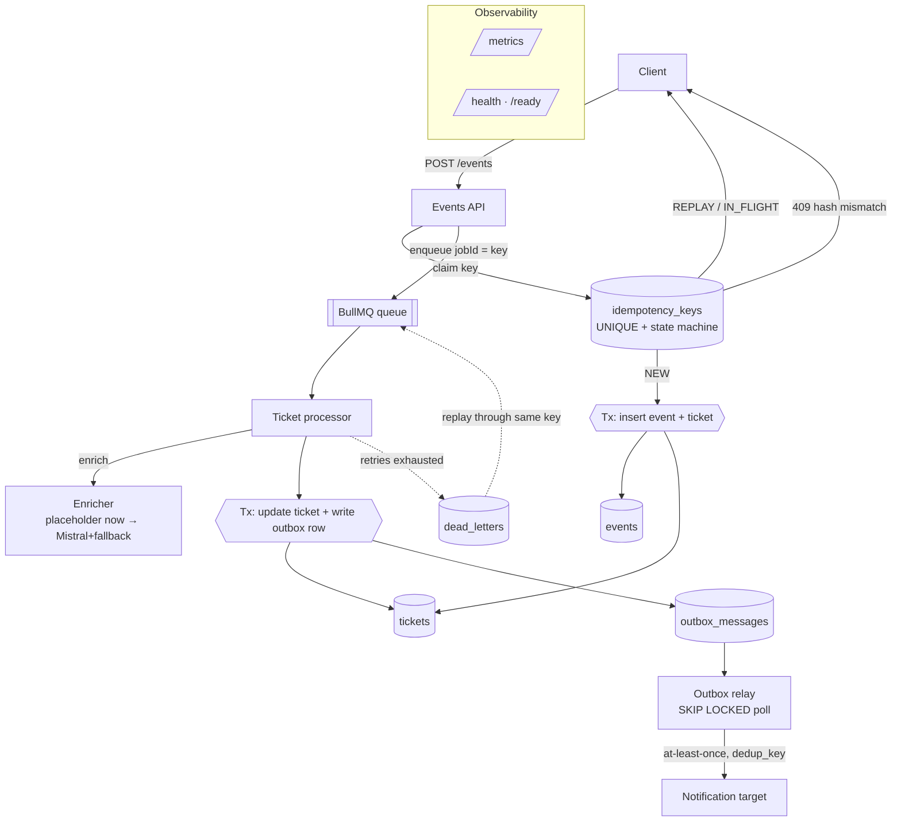

# Triage Engine — an idempotent job-processing engine with AI enrichment

<!-- Replace OWNER/REPO with your GitHub slug once the repo is pushed. -->
[](https://github.com/OWNER/REPO/actions/workflows/ci.yml)

A production-grade event-processing engine (NestJS + Postgres + Redis/BullMQ) that
ingests support tickets, runs them through a resilient pipeline, and enriches them
with an LLM classification. **The AI is the small part. The engineering around it
— making the pipeline correct under retries, concurrency, and partial failure —
is the point.**

## The problem

Support tickets arrive as events from clients and upstream systems that retry on
timeouts and deliver at-least-once. A real pipeline therefore has to survive
duplicate deliveries, concurrent duplicates, worker crashes mid-processing, a flaky
downstream notification target, and an LLM that is sometimes slow, wrong-shaped, or
down — **without ever dropping a ticket, duplicating one, or silently losing a side
effect.**

## The through-line: nothing is ever silently lost

Every mechanism in this repo is one instance of a single principle. If you
understand the principle, the whole system reads as one idea rather than a pile of
patterns:

| Where work could be lost | Mechanism that prevents it | ADR |
| --- | --- | --- |
| Duplicate / concurrent submissions duplicating work | Idempotency ledger: `UNIQUE` key + status state machine, DB-level race resolution | [0001](docs/adr/0001-idempotency-strategy.md) |
| A committed state change whose notification never fires | Transactional outbox: side effect written in the same transaction as the state change | [0004](docs/adr/0004-outbox-pattern.md) |
| A side effect lost between commit and HTTP call | Outbox relay: at-least-once dispatch, `FOR UPDATE SKIP LOCKED` poll | [0008](docs/adr/0008-outbox-relay-polling.md) |
| A job that exhausts retries vanishing | Durable DLQ table with full error context + replay endpoint | [0007](docs/adr/0007-durable-dlq-table.md) |
| A ticket dropped because the AI is down | Graceful degradation: rule-based fallback now, AI upgrade re-queued later | [0005](docs/adr/0005-ai-failure-handling.md) / [0006](docs/adr/0006-fallback-classifier.md) |
| Bad/garbage model output persisted | Every response zod-validated; failure treated as transient → retry → breaker → fallback | [0005](docs/adr/0005-ai-failure-handling.md) |
| A ticket stuck DEGRADED if its upgrade job is lost | Reconciliation sweep re-drives stale DEGRADED tickets (DB is the source of truth) | [0009](docs/adr/0009-degraded-reconciliation-sweep.md) |

## Architecture



Pipeline stages: **validate & persist raw event → deduplicate via idempotency key
→ enrich → store result + write side effect (same transaction) → relay dispatches
the side effect.** A correlation id is minted at ingestion and threaded through the
HTTP request, the queue job, the worker, and the dispatch via `AsyncLocalStorage`,
so one id traces a ticket end-to-end.

## Key design decisions

- **Idempotency = unique key + status machine, resolved in the database.** The
  `UNIQUE(idempotency_key)` constraint + `INSERT … ON CONFLICT DO NOTHING` decides
  the race; a lease handles crashed workers. No application locks. → [ADR-0001](docs/adr/0001-idempotency-strategy.md)
- **TypeORM, chosen for a specific reason.** The system is dominated by hand-tuned
  transactional SQL (`FOR UPDATE SKIP LOCKED`, same-transaction outbox writes), and
  TypeORM exposes that as a first-class citizen. For a typical CRUD product I'd
  reach for Prisma; here I deliberately did not. → [ADR-0002](docs/adr/0002-orm-choice.md)
- **Transactional outbox for side effects.** The notification row is written in the
  same transaction as the state change, then a relay delivers it at-least-once with
  a collision-safe `dedup_key`. → [ADR-0004](docs/adr/0004-outbox-pattern.md) · [ADR-0008](docs/adr/0008-outbox-relay-polling.md)
- **Durable DLQ over Redis's failed set.** Exhausted jobs land in a queryable
  Postgres table with full context; replay re-enters through the **same idempotency
  key**, so it cannot duplicate a ticket or a side effect. → [ADR-0007](docs/adr/0007-durable-dlq-table.md)
- **AI failure handling & a rule-based fallback** — every Mistral call is
  timed out, retried with jitter, wrapped in a circuit breaker, and zod-validated;
  on any failure the ticket degrades to a rule-based classification and is
  re-queued to upgrade to AI later. The AI is never on the critical path for
  *availability*, only *quality*. → [ADR-0003](docs/adr/0003-circuit-breaker.md) · [ADR-0005](docs/adr/0005-ai-failure-handling.md) · [ADR-0006](docs/adr/0006-fallback-classifier.md)
- **Self-healing reconciliation** — a sweep treats Postgres as the source of
  truth and re-drives any ticket left stranded in DEGRADED (lost upgrade job,
  crash, or exhausted attempts), closing the one path that could otherwise stay
  silently degraded. → [ADR-0009](docs/adr/0009-degraded-reconciliation-sweep.md)

All nine decisions are recorded as ADRs — see [`docs/adr/`](docs/adr/).

## API

| Method & path | Purpose |
| --- | --- |
| `POST /events` | Ingest an event. Returns **202** (`accepted` / `processing` / `replayed`); **409** on key reuse with a different body. Idempotent. |
| `GET /tickets/:id` | Retrieve a ticket with its enrichment status/result. |
| `GET /dlq` | List dead-lettered jobs (filter `?status=`, paginate). |
| `POST /dlq/:id/replay` | Replay a dead letter through its original idempotency key. **202**. |
| `GET /metrics` | Prometheus exposition (ingest/process/fail counters, enrichment latency, circuit-breaker state, queue/DLQ/outbox depths). |
| `GET /health` · `GET /ready` | Liveness (process up) · readiness (Postgres + Redis reachable). |
| `POST /_sink/webhook` · `GET /_sink/deliveries` | Bundled **idempotent** notification target, so the stack runs fully offline. |

## Build status

Core engine **and** AI enrichment layer are complete and verified end-to-end
against real Postgres + Redis (and a mock Mistral HTTP boundary): idempotency
race, pipeline, DLQ + replay, outbox relay, AI success, graceful degradation,
circuit-breaker open/half-open/close, and the degrade-then-upgrade flow with its
distinct side effect. The enricher sits behind a swappable `ENRICHER` token, so
the AI plugged in as a provider swap with no change to the pipeline.

## Limitations & next steps

Honest about what I'd add at scale and what I deliberately did not build:

- **Idempotency retention.** The `idempotency_keys` table grows unbounded. I'd add
  a reaper for `COMPLETED` rows older than the client's retry window, surfaced as a
  job + metric. (Seen, not built — see [ADR-0001](docs/adr/0001-idempotency-strategy.md).)
- **Outbox relay at high throughput.** Today the relay holds the row lock across the
  HTTP dispatch. The scale move is *claim-then-dispatch* with a lease, dispatching
  outside the transaction. ([ADR-0008](docs/adr/0008-outbox-relay-polling.md).)
- **Backpressure & partitioning.** No ingress backpressure or per-tenant queue
  partitioning yet; both matter once one noisy tenant can starve others.
- **Batching enrichment.** LLM calls are per-ticket; batching would cut cost/latency.
- **Multi-region outbox / exactly-once illusion**, and an ingestion→enqueue
  reconciliation for the (idempotent, safe) window between commit and enqueue —
  the analogue, on the ingestion side, of the DEGRADED sweep
  ([ADR-0009](docs/adr/0009-degraded-reconciliation-sweep.md)) that is already built.
- **Reconciliation at scale.** The DEGRADED sweep runs on every instance; an
  advisory-lock/leader guard would stop the scan being duplicated across replicas.

---

## Running it

### Prerequisites
Docker + Docker Compose. (For host-mode dev: Node 22+.)

### One command

```bash
make up      # build + start app, postgres, redis; creates .env from .env.example
make seed    # POST a few sample tickets
make logs    # tail the app
make down    # stop and remove volumes
```

Then:

```bash
curl localhost:3000/health
curl -XPOST localhost:3000/events -H 'content-type: application/json' \
  -d '{"idempotencyKey":"demo-1","subject":"Double charged","body":"Refund please","requesterEmail":"a@b.com"}'
curl localhost:3000/tickets/<id-from-response>
curl localhost:3000/metrics
curl localhost:3000/_sink/deliveries
```

### Port conflicts

The published ports default to `5432` (Postgres) and `6379` (Redis). If those are
taken on your host, remap **only the published ports** — they are decoupled from the
in-container ports, so the app keeps working:

```bash
POSTGRES_PORT=5440 REDIS_PORT=6390 make up
```

### Configuration

All config is in `.env` (copy from [`.env.example`](.env.example), which documents
every value). The app boots and **degrades gracefully** if `MISTRAL_API_KEY` is
absent — it never crashes for a missing key.

### Migrations

Schema changes go through explicit, reviewable migrations (never `synchronize`).
The demo stack runs them on boot (`DB_RUN_MIGRATIONS_ON_BOOT=true`); otherwise:

```bash
make migrate            # npm run migration:run
```

### Tests — why they run against real infrastructure

During development the idempotency reclaim and the DLQ replay both passed every
unit check, and 12 concurrent identical submissions still produced exactly one
ticket. But the *responses* were wrong: 11 of 12 reported `accepted` instead of
`replayed`. The cause was a TypeORM footgun — its raw `query()` returns a flat
rows array for `INSERT … RETURNING` but a `[rows, affectedCount]` **2-tuple** for
`UPDATE … RETURNING`, so a `.length > 0` check on the reclaim was *always* true and
handed `NEW` to every concurrent caller. The data invariant held only because the
`FOR UPDATE` lock and the outbox `dedup_key` independently absorbed the wrong
semantics — defense in depth degraded a logic bug into a latent
correctness-of-semantics issue instead of a data-corruption one.

A green unit suite would never have caught this. **Only running the real thing,
concurrently, against a real database did.** That is the entire reason this
project's tests are integration tests over real infra, not mock-heavy unit tests:

- **Postgres and Redis are real** (via Testcontainers) — the concurrency,
  `SKIP LOCKED`, and `RETURNING` semantics are exactly what production runs.
- **Only the Mistral HTTP boundary is mocked** — and even then by pointing the real
  SDK at a local mock server (`MISTRAL_SERVER_URL`), so the client, validation,
  retry, and breaker all execute for real. Nothing internal is stubbed.

The suite proves the hard requirements actually hold: one ticket + one side effect
per key, no double-processing under concurrency, graceful degradation + breaker
opening when Mistral fails, at-least-once outbox delivery, and DLQ replay that
doesn't duplicate.

```bash
make test
```
